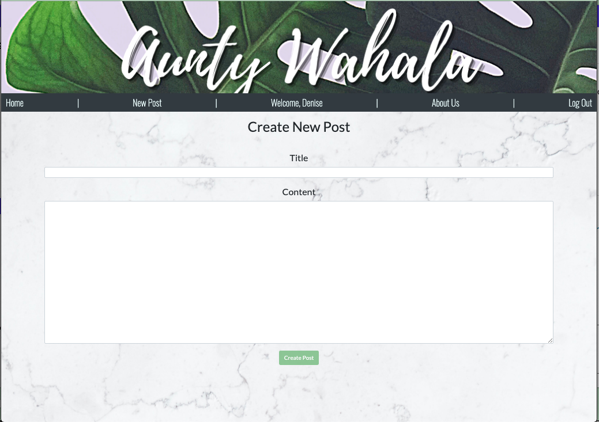
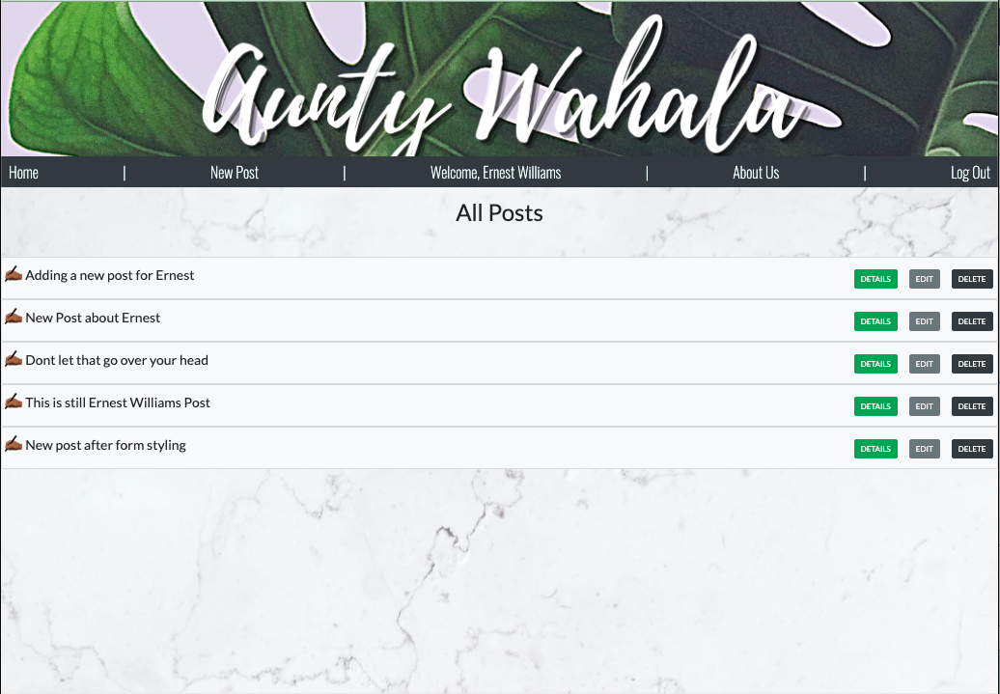
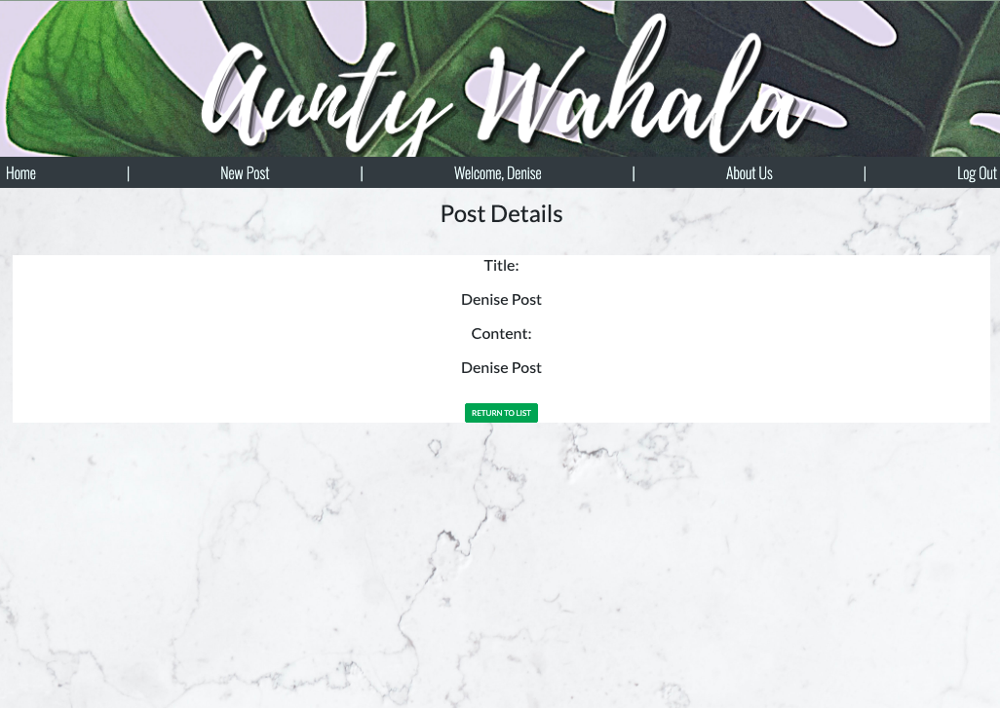

# Aunty Wahala Blog 

## Introduction

The objective of Aunty Wahala is to provide a space where people from all walks of life can congregate to laugh, commiserate, vent and learn from one another's experiences. 

 
But Why Would You Call Your blog Aunty Wahala?  

<strong>Let’s break it down...</strong>  

Where we’re from the word “aunty” is used to address older women as a sign of respect.But to be clear, little kids will call a woman in her late twenties aunty, teenagers will call older women they 
just met aunty, and parents will call female elders aunty also. So a friend of our mom is our aunty but the lady selling street food is also called aunty. Still with us…? The word "wahala" means trouble or problem in Yoruba but it is commonly used amongst people of the African diaspora.  

Currently, this site allows a user to sign up, log in and create a post/ suggestion. At this time they are only able to view, edit or delete posts made by them.  

## This is just the beginning
 

### Planning
 
Check in periodically to watch this blog progress into final form as we plan. https://trello.com/b/b7Tkh2fX/aw-blog  

 

## Current Progress

## Technologies Used

- MERN Stack (MongoDB/Mongoose, Express, React and Node)
- Bootstrap
- CSS

## Take a look at the current site:

https://auntywahala.herokuapp.com/

## Current Next Steps

- Create a login admin this only allowed to post blog articles and update token-based authenication features
- Allow readers to log in and add comments to articles/posts, edit or delete their comments as well as comment on other readers comments
- Style the home page to give a more blog-like feel
- Create a section search bar

## Future Uses 

Not interested in making or using a blog? While you monitor our progress, feel free to use this for your own needs such as a bill tracker or job application tracker! Who knows?! You may just come up with the next best idea!

